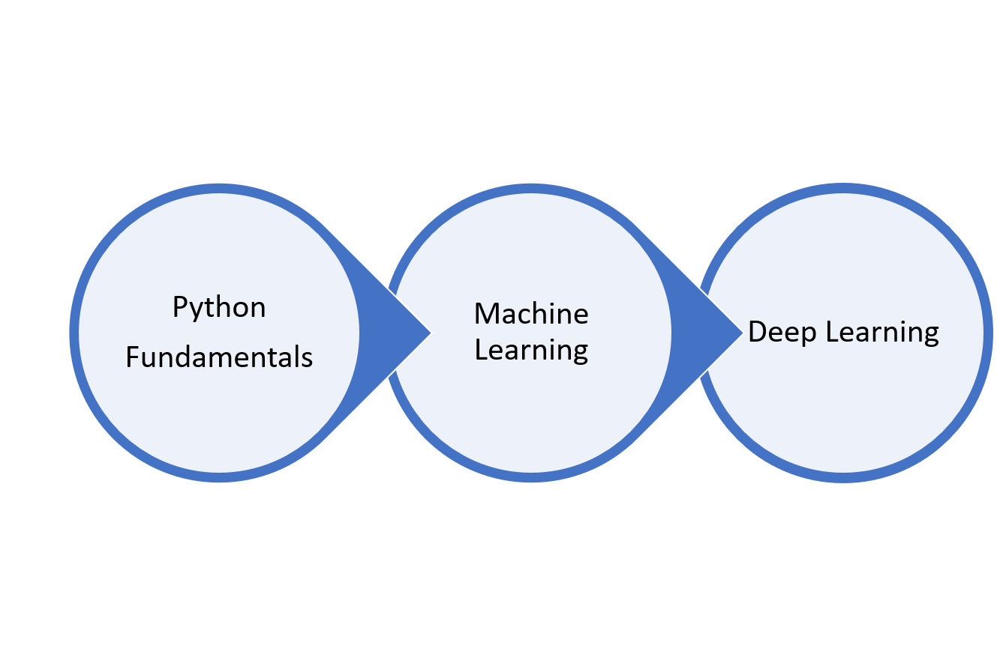

# **AICircle-Cycle1**

#### AICircle is aimed at helping AI enthusiasts learn the core concepts and best practices to hone the skills of Artificial Intelligence.

The [AICircle](https://github.com/harishrb/AICircle) GitHub repository is for anyone who is curious about Artificial Intelligence but has no idea where to start. Contents in the repository tries wavering prerequisites to the maximum extent covering fundamentals of Python programming and links to resources of math required, yet keeping the concepts concise.

### Usage
**Fork** the repository on GitHub to access contents from the AICircle meetups and other curated resources. 

**Clone or download** the repository for offline use. Notebooks in the repository can be accessed offline by running `jupyter notebook` from terminal. Install jupyter from [here](http://jupyter.readthedocs.io/en/latest/install.html). Install missing dependencies using [pip](https://pypi.org/project/pip/).

---

### Roadmap

---

## AICircle Sessions

+ [Session 1](https://github.com/harishrb/AICircle/tree/master/Sessions/Session%201)
+ [Session 2](https://github.com/harishrb/AICircle/tree/master/Sessions/Session%202)
+ [Session 3](https://github.com/harishrb/AICircle/tree/master/Sessions/Session%203)
