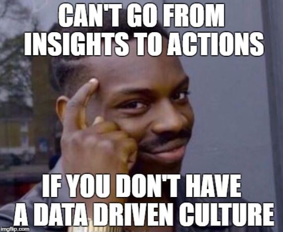

# AICircle-Cycle1

#### A simplistic and structured approach of understanding the intricacies around Data Science, Machine Learning and Deep Learning.

The [AICircle](https://github.com/harishrb/AICircle) GitHub repository is for anyone who is curious about Data Science, Machine Learning and Deep Learning but has no idea where to start. Contents in the repository tries wavering prerequisites to the maximum extent covering fundamentals of Python programming and links to resources of math required, yet keeping the concepts concise.

### Usage
**Fork** the repository on GitHub to access contents from the AICircle meetups and other curated resources. 

**Clone or download** the repository for offline use. Notebooks in the repository can be accessed offline by running `jupyter notebook` from terminal. Install jupyter from [here](http://jupyter.readthedocs.io/en/latest/install.html). Install missing dependencies using [pip](https://pypi.org/project/pip/).

------

### Roadmap

------

## AICircle Sessions

+ Session 1 - Intro and Motivation
  
  [Introductory session](https://github.com/harishrb/AICircle/tree/master/Sessions/Session%201) - Getting to know the community, Understanding GitHub, Artificial Intelligence - Intro and Motivation.

##### We will stick to using Python as our preferred programming language throughout this repository.

+ Session 2 - Pyhton Fundamentals

  Jupyter Notebook for [Python Fundamentals](https://github.com/harishrb/AICircle/tree/master/Sessions/Session%202).

---

#### **Data Science is interdisciplinary field that uses scientific methods, processes, algorithms and systems to extract knowledge and insights from data in various forms.** 
  
   ***How does that matter to Machine Learning?***
  
  

  We know from our [Introductory session](https://github.com/harishrb/AICircle/tree/master/Sessions/Session%201) that Machine Learning    is dependent on the training experience. That should get you thinking about how data is responsible for training a model. We will learn how in the upcoming sessions. Essentially, Python core libraries for Data Science.

+ Session 3 - Numpy

  Jupyter Notebook for [Numpy](https://github.com/harishrb/AICircle/tree/master/Sessions/Session%203).
  
  Complete this [Numpy Exercise](https://github.com/harishrb/AICircle/blob/master/Resources/Exercises/Numpy%20Exercise.ipynb) to self     assess your understanding of the basic concepts of Numpy. (Difficulty level - Easy)
  
   
---
  
## Additional Resources
+ [Machine Learning Glossary](https://developers.google.com/machine-learning/glossary/)

